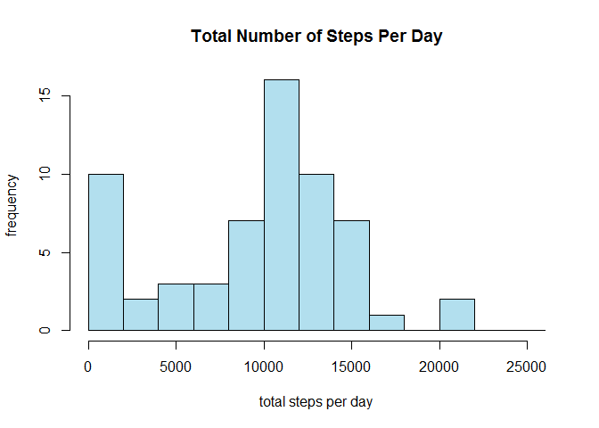
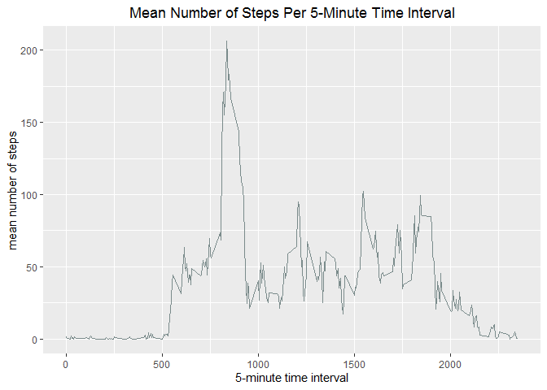
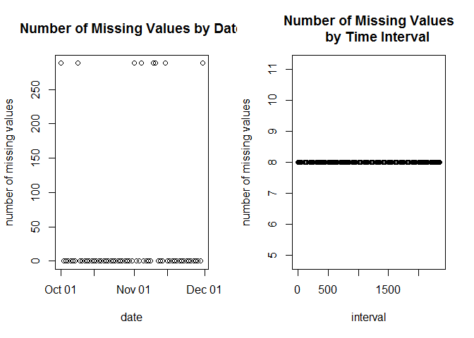
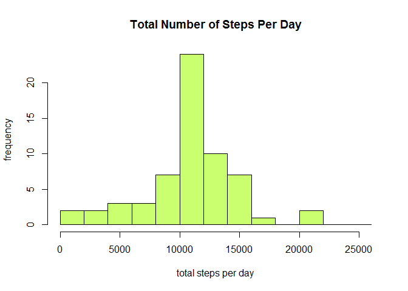
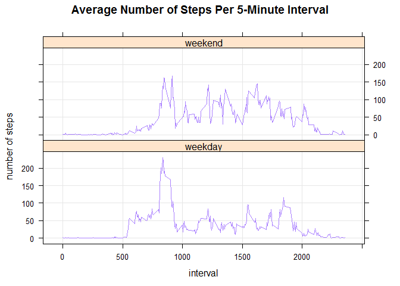

## Introduction and Dataset

It is now possible to collect a large amount of data about personal movement using activity monitoring devices such as [Fitbit](http://www.fitbit.com/), [Nike Fuelband](http://www.nike.com/us/en_us/c/nikeplus-fuelband), or [Jawbone Up](https://jawbone.com/up). These type of devices are part of the "quantified self" movement - a group of enthusiasts who take measurements about themselves regularly to improve their health, to find patterns in their behavior, or because they are tech geeks. But these data remain under-utilized both because the raw data are hard to obtain and there is a lack of statistical methods and software for processing and interpreting the data.

This assignment makes use of data from a personal activity monitoring device. This device collects data at 5 minute intervals through out the day. The data consists of two months of data from an anonymous individual collected during the months of October and November, 2012 and include the number of steps taken in 5 minute intervals each day.

The activity-monitoring data can be downloaded [here](https://d396qusza40orc.cloudfront.net/repdata%2Fdata%2Factivity.zip).

## Loading and preprocessing the data

First, load the data:


```r
# define source data zip file name
sourceDataZipFile <- "activity.zip"

# define source data directory name
sourceDataPath <- "activity"

# if not already done, unzip source dataset to new data directory
if (!file.exists(sourceDataPath)) {
  unzip(sourceDataZipFile)
}

# read file into a data frame
activityData <- read.csv("activity.csv")
```

Here is an initial look at the dataset:


```r
# look at a summary of the data
head(activityData)
```

```
##   steps       date interval
## 1    NA 2012-10-01        0
## 2    NA 2012-10-01        5
## 3    NA 2012-10-01       10
## 4    NA 2012-10-01       15
## 5    NA 2012-10-01       20
## 6    NA 2012-10-01       25
```

```r
str(activityData)
```

```
## 'data.frame':	17568 obs. of  3 variables:
##  $ steps   : int  NA NA NA NA NA NA NA NA NA NA ...
##  $ date    : Factor w/ 61 levels "2012-10-01","2012-10-02",..: 1 1 1 1 1 1 1 1 1 1 ...
##  $ interval: int  0 5 10 15 20 25 30 35 40 45 ...
```

There are 17,568 observations (measurements) and three variables:

- **steps**: number of steps taken in a five-minute interval
- **date**: the date on which the measurement was taken in YYYY-MM-DD format
- **interval**: identifier for the five-minute interval in which the measurement was taken

There are also some missing values for the "steps" variable:


```r
# calculate fraction of missing values for "steps" variable
sum(is.na(activityData$steps))/dim(activityData)[[1]]
```

```
## [1] 0.1311475
```

Necessary preprocessing:

- Convert the "date" variable to date format: 


```r
library(lubridate)
```

```
## Warning: package 'lubridate' was built under R version 3.6.2
```

```
## 
## Attaching package: 'lubridate'
```

```
## The following object is masked from 'package:base':
## 
##     date
```

```r
activityData$date <- ymd(activityData$date)
```

## What is mean total number of steps taken per day?

Calculate the total number of steps taken per day:


```r
# create a data frame containing each date and the corresponding number of steps
stepsPerDay <- with(activityData, aggregate(steps, by=list(date), FUN=sum, na.rm=TRUE))
names(stepsPerDay) <- c("date", "steps")
head(stepsPerDay)
```

```
##         date steps
## 1 2012-10-01     0
## 2 2012-10-02   126
## 3 2012-10-03 11352
## 4 2012-10-04 12116
## 5 2012-10-05 13294
## 6 2012-10-06 15420
```

Make a histogram of the total number of steps each day:


```r
hist(stepsPerDay$steps, main="Total Number of Steps Per Day", xlab="total steps per day", 
     ylab="frequency", col="lightblue2", breaks=seq(0, 26000, by=2000))
```

<!-- -->

Calculate and report the mean and median of the total number of steps taken per day.

The mean number of steps taken per day is:


```r
mean(stepsPerDay$steps)
```

```
## [1] 9354.23
```

The median number of steps taken per day is:


```r
median(stepsPerDay$steps)
```

```
## [1] 10395
```

## What is the average daily activity pattern?

Make a time series plot of the 5-minute interval (x-axis) and the average number of steps taken, averaged across all days (y-axis):


```r
# calculate average number of steps for each 5-minute interval, averaged across all days
# and store information in data frame
avgStepsInterval <- with(activityData, aggregate(steps, by=list(interval), FUN=mean, na.rm=TRUE))

# assign column names to new data frame
names(avgStepsInterval) <- c("interval", "mean.steps")

# generate time series plot
library(ggplot2)
```

```
## Warning: package 'ggplot2' was built under R version 3.6.3
```

```r
g <- ggplot(avgStepsInterval, aes(interval, mean.steps))
g <- g + geom_line(color="lightcyan4") + xlab("5-minute time interval") + 
  ylab("mean number of steps") + ggtitle("Mean Number of Steps Per 5-Minute Time Interval") + 
  theme(plot.title=element_text(hjust=0.5))

# display plot
print(g)
```

<!-- -->

Determine which 5-minute time interval, on average across all the days in the dataset, contains the maximum number of steps:


```r
avgStepsInterval[which.max(avgStepsInterval$mean.steps), ]$interval
```

```
## [1] 835
```

## Imputing missing values

As seen before, a substantial number of days/time intervals are missing values (coded as NA). The presence of missing days may introduce bias into some calculations or summaries of the data.

Calculate and report the total number of missing values in the dataset:


```r
sum(is.na(activityData$steps))
```

```
## [1] 2304
```

Devise a strategy for filling in all of the missing values in the dataset. The strategy does not need to be sophisticated. For example, you could use the mean/median for that day, or the mean for that 5-minute interval, etc.

To determine whether to use the mean for the specified day or the mean for the specified five-minute time interval, let's look at the distributions of missing values over days and 5-minute time intervals:


```r
# add a column to original dataset to determine if the number of steps for each observation is missing
activityData$missing <- is.na(activityData$steps)

# determine the total number of missing values per day
missingStepsDate <- with(activityData, aggregate(missing ~ date, FUN=sum))

# determine the total number of missing values per 5-minute time interval
missingStepsInterval <- with(activityData, aggregate(missing ~ interval, FUN=sum))
```


```r
# plot numbers of missing values per day and per 5-minute time interval
par(mfrow=c(1, 2))
plot(x=missingStepsDate$date, y=missingStepsDate$missing, main = "Number of Missing Values by Date",
     xlab="date", ylab="number of missing values")
plot(x=missingStepsInterval$interval, y=missingStepsInterval$missing, main = "Number of Missing Values
     by Time Interval", xlab="interval", ylab="number of missing values")
```

<!-- -->

Most days have no missing values, but a few have more than 250. By constrast, each 5-minute time interval contains eight missing values. Therefore, it makes the most sense to assign the average number of steps for each 5-minute time interval.

Fill in the missing values in the dataset by assigning the average number of steps for the given five-minute time interval:


```r
# calculate imputed numbers of steps for each observation
imputedNumSteps <- avgStepsInterval$mean.steps[match(activityData$interval, avgStepsInterval$interval)]
```


```r
activityData <- transform(activityData, steps=ifelse(missing == TRUE, yes=imputedNumSteps, no=activityData$steps))
activityData <- activityData[, -which(names(activityData) %in% c("missing"))]
```

Make a histogram of the total number of steps taken each day and calculate and report the **mean** and **median** total number of steps taken per day. Do these values differ from the estimates from the first part of the assignment? What is the impact of imputing missing data on the estimates of the total daily number of steps?

Recalculate the number of steps taken each day:


```r
# create a data frame containing each date and the corresponding number of steps
stepsPerDayImpute <- with(activityData, aggregate(steps, by=list(date), FUN=sum))
names(stepsPerDayImpute) <- c("date", "steps")
head(stepsPerDayImpute)
```

```
##         date    steps
## 1 2012-10-01 10766.19
## 2 2012-10-02   126.00
## 3 2012-10-03 11352.00
## 4 2012-10-04 12116.00
## 5 2012-10-05 13294.00
## 6 2012-10-06 15420.00
```

The mean number of steps taken per day (using imputed data) is:


```r
mean(stepsPerDayImpute$steps)
```

```
## [1] 10766.19
```

The median number of steps taken per day (using imputed data) is:


```r
median(stepsPerDayImpute$steps)
```

```
## [1] 10766.19
```

Generate a histogram of the total number of steps per day (using imputed data):


```r
hist(stepsPerDayImpute$steps, main="Total Number of Steps Per Day", xlab="total steps per day", 
     ylab="frequency", col="darkolivegreen1", breaks=seq(0, 26000, by=2000))
```

<!-- -->

Both the mean and median total numbers of steps per day increased slightly, and the shape of the frequency distribution is now closer to a normal distribution. The 0-2000 step peak is no longer present.

## Are there differences in activity patterns between weekdays and weekends?

Create a new factor variable in the dataset with two levels - "weekday" and "weekend" indicating whether a given date is a weekday or weekend day.


```r
# create a column with day of the week for each observation
activityData$dayOfWeek <- weekdays(activityData$date)

# assign "weekday" or "weekend" to each observation 
activityData$dayOfWeekType <- sapply(activityData$dayOfWeek, function(x) {
  if (x == "Saturday" | x == "Sunday")
  {y <- "weekend"}
  else
  {y <- "weekday"}
  return(y)
})

# remove column with day of the week
activityData <- activityData[, -which(names(activityData) %in% c("dayOfWeek"))]

head(activityData)
```

```
##       steps       date interval dayOfWeekType
## 1 1.7169811 2012-10-01        0       weekday
## 2 0.3396226 2012-10-01        5       weekday
## 3 0.1320755 2012-10-01       10       weekday
## 4 0.1509434 2012-10-01       15       weekday
## 5 0.0754717 2012-10-01       20       weekday
## 6 2.0943396 2012-10-01       25       weekday
```

Calcluate the average number of steps taken for each time interval across all weekdays and weekend days.


```r
avgStepsIntByDateType <- with(activityData, aggregate(steps ~ interval+dayOfWeekType, FUN=mean))
```

Make a panel plot containing a time series plot of the 5-minute interval (x-axis) and the average number of steps taken, averaged across all weekday days or weekend days (y-axis).


```r
library(lattice)
xyplot(data=avgStepsIntByDateType, steps~interval|dayOfWeekType, grid=TRUE, type="l", layout=c(1, 2), col="mediumpurple1", xlab="interval", ylab="number of steps", main="Average Number of Steps Per 5-Minute Interval")
```

<!-- -->
